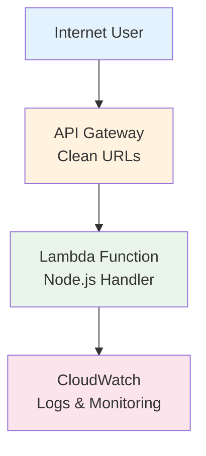

# HelloHexa DevOps Test

Simple serverless web application deployed to AWS ap-southeast-2 (Sydney).

## ✅ Requirements Met

✅ **Simple web server** responding to GET /hello with "OK" and 200 status  
✅ **Deployed to AWS** using Infrastructure as Code (Terraform)  
✅ **Serverless architecture** with auto-scaling and cost optimization  
✅ **Security headers** and infrastructure-level protection  

## 🚀 Live Application

**Application URL**: `https://snp07vtku6.execute-api.ap-southeast-2.amazonaws.com`

### Available Endpoints
- **GET /hello** → Returns "OK" (public endpoint)
- **GET /health** → Returns health status (public endpoint)  
- **GET /** → Returns API information (public endpoint)

## 🏗️ Architecture

**Serverless Web Application:**
- **AWS Lambda** - Node.js function handler
- **API Gateway** - HTTP API with clean URLs
- **CloudWatch** - Logging and monitoring
- **Cost**: ~$1.11/month for 1M requests

### Architecture Diagram



## 🛠️ Quick Deploy

### Prerequisites
- AWS CLI configured (`aws configure`)
- Terraform installed

### Deploy
```bash
cd terraform
terraform init
terraform apply
```

### Test
```bash
# Get the application URL
terraform output application_url

# Test the required endpoint
curl https://snp07vtku6.execute-api.ap-southeast-2.amazonaws.com/hello
# Expected: OK

# Test other endpoints
curl https://snp07vtku6.execute-api.ap-southeast-2.amazonaws.com/health
curl https://snp07vtku6.execute-api.ap-southeast-2.amazonaws.com/
```

### Cleanup
```bash
terraform destroy
```

## 📁 Project Structure
```
├── src/
│   └── lambda.js          # Lambda function handler
├── terraform/             # Infrastructure as Code
│   ├── main.tf           # Core infrastructure
│   ├── lambda.tf         # Lambda configuration
│   ├── api_gateway.tf    # API Gateway setup
│   └── outputs.tf        # Output values
├── test/
│   └── lambda-test.js    # Test suite
└── scripts/              # Deploy/destroy scripts
```

## 🔧 Why Serverless?

**Cost Efficient**: Pay only for actual requests, not idle time  
**Auto-scaling**: Handles 0 to thousands of requests automatically  
**Zero maintenance**: No servers to patch, update, or manage  
**High availability**: Built-in fault tolerance across multiple AZs  

## 📊 Cost Breakdown

| Service | Monthly Cost (1M requests) |
|---------|---------------------------|
| AWS Lambda | $0.10 |
| API Gateway | $1.00 |
| CloudWatch | $0.01 |
| **Total** | **$1.11** |

*See [COST_ANALYSIS.md](COST_ANALYSIS.md) for detailed breakdown*

## 🧪 Local Testing
```bash
npm test                  # Run test suite
npm run test-lambda       # Test Lambda function
```

## 🌐 Infrastructure Features

✅ **Clean URLs** - No environment prefixes in endpoints  
✅ **Security headers** - HSTS, XSS protection, content security  
✅ **Monitoring** - CloudWatch logs and metrics  
✅ **Terraform** - Complete Infrastructure as Code  
✅ **Auto-scaling** - Serverless scaling from 0 to ∞  

---

**Author**: Tarun Kumar Manoharan  
**Region**: ap-southeast-2 (Sydney)  
**Architecture**: Serverless Web Application  

Simple, cost-effective, and production-ready! 🚀


