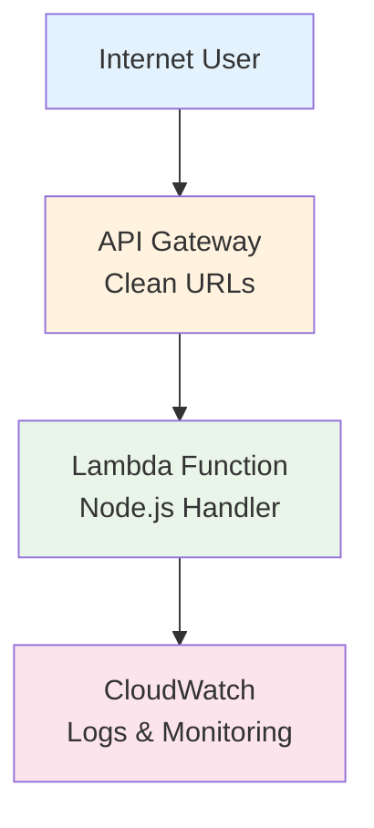

# HelloHexa DevOps

Simple serverless web application deployed to AWS ap-southeast-2 (Sydney).

## ✅ Requirements Met

✅ **Simple web server** responding to GET /hello with "OK" and 200 status  
✅ **Deployed to AWS** using Infrastructure as Code (Terraform)  
✅ **Serverless architecture** with auto-scaling and cost optimization  
✅ **Security headers** and infrastructure-level protection  

## 🚀 Live Application

**Application URL**: `https://snp07vtku6.execute-api.ap-southeast-2.amazonaws.com`

### Available Endpoints
- **GET /hello** → Returns "OK" (public endpoint)
- **GET /health** → Returns health status (public endpoint)  
- **GET /** → Returns API information (public endpoint)

## 🏗️ Architecture

**Serverless Web Application:**
- **AWS Lambda** - Node.js function handler
- **API Gateway** - HTTP API with clean URLs
- **CloudWatch** - Logging and monitoring
- **Cost**: ~$1.11/month for 1M requests

### Architecture Diagram



## 🛠️ Quick Deploy

### Prerequisites

#### Required Software
- **Docker** - [Installation Guide](https://docs.docker.com/get-docker/)
- **Docker Compose** - Usually included with Docker Desktop

#### AWS Account Setup
1. **AWS Account** with appropriate permissions:
   ```
   - AWSLambda Access
   - AmazonAPIGatewayInvoke Access
   - AmazonAPIGatewayAdministrator
   - CloudWatchLogsFullAccess
   - IAM Access (for creating Lambda execution role)
   ```

2. **AWS CLI Configuration** (on your local machine):
   ```bash
   aws configure
   # Enter your AWS Access Key ID
   # Enter your AWS Secret Access Key
   # Default region: ap-southeast-2
   # Default output format: json
   ```

**Note**: All other tools (AWS CLI, Terraform, Node.js) are included in the Docker container!

### Deploy

#### Step-by-Step Deployment

1. **Clone the Repository**:
   ```bash
   git clone <repository-url>
   cd hellohexa
   ```

2. **Configure AWS Credentials** (one-time setup):
   ```bash
   aws configure
   # Enter your AWS credentials
   ```

3. **Deploy with Docker** (one command!):
   ```bash
   ./scripts/deploy-docker.sh
   ```

That's it! The Docker container handles:
- ✅ AWS CLI installation and configuration
- ✅ Terraform installation and initialization  
- ✅ Infrastructure deployment
- ✅ Lambda function packaging and deployment

### Test
```bash
# Get the application URL
terraform output application_url

# Test the required endpoint
curl https://snp07vtku6.execute-api.ap-southeast-2.amazonaws.com/hello
# Expected: OK

# Test other endpoints
curl https://snp07vtku6.execute-api.ap-southeast-2.amazonaws.com/health
curl https://snp07vtku6.execute-api.ap-southeast-2.amazonaws.com/
```

### Cleanup
```bash
./scripts/destroy-docker.sh
```

## 🔧 Deployment Troubleshooting

### Common Issues

#### 1. AWS Credentials Not Configured  
**Error**: `Unable to locate credentials`  
**Solution**: Run `aws configure` and enter your AWS credentials

#### 2. Insufficient Permissions  
**Error**: `AccessDenied` or `UnauthorizedOperation`  
**Solution**: Ensure your AWS user has the required IAM permissions listed above

#### 3. Region Mismatch  
**Error**: Resources not found or deployment fails  
**Solution**: Ensure AWS CLI is configured for `ap-southeast-2` region

#### 4. Docker Not Running  
**Error**: `Cannot connect to the Docker daemon`  
**Solution**: Start Docker Desktop or Docker service

#### 5. Port/Network Issues  
**Error**: Cannot reach deployed endpoints  
**Solution**: Check if endpoints return HTTP 200 status, wait 2-3 minutes after deployment

## 📁 Project Structure
```
├── src/
│   └── lambda.js          # Lambda function handler
├── terraform/             # Infrastructure as Code
│   ├── main.tf           # Core infrastructure
│   ├── lambda.tf         # Lambda configuration
│   ├── api_gateway.tf    # API Gateway setup
│   └── outputs.tf        # Output values
├── test/
│   └── lambda-test.js    # Test suite
└── scripts/              # Deploy/destroy scripts
```

## 🔧 Why Serverless?

**Cost Efficient**: Pay only for actual requests, not idle time  
**Auto-scaling**: Handles 0 to thousands of requests automatically  
**Zero maintenance**: No servers to patch, update, or manage  
**High availability**: Built-in fault tolerance across multiple AZs  

## 📊 Cost Breakdown

| Service | Monthly Cost (1M requests) |
|---------|---------------------------|
| AWS Lambda | $0.10 |
| API Gateway | $1.00 |
| CloudWatch | $0.01 |
| **Total** | **$1.11** |

*See [COST_ANALYSIS.md](COST_ANALYSIS.md) for detailed breakdown*

## 🧪 Local Testing
```bash
npm test                  # Run test suite
npm run test-lambda       # Test Lambda function
```

## 🌐 Infrastructure Features

✅ **Clean URLs** - No environment prefixes in endpoints  
✅ **Security headers** - HSTS, XSS protection, content security  
✅ **Monitoring** - CloudWatch logs and metrics  
✅ **Terraform** - Complete Infrastructure as Code  
✅ **Auto-scaling** - Serverless scaling from 0 to ∞  

---

**Author**: Tarun Kumar Manoharan  
**Region**: ap-southeast-2 (Sydney)  
**Architecture**: Serverless Web Application  


