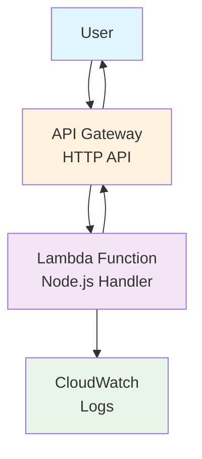

# HelloHexa DevOps Test

Simple serverless web application deployed to AWS ap-southeast-2 (Sydney).

## Requirements Met

✅ Simple web server responding to GET /hello with "OK" and 200 status  
✅ Deployed to AWS using Infrastructure as Code (Terraform)  
✅ **SECURED** with API Key authentication, WAF protection, and rate limiting  
✅ Cost-optimized serverless architecture  

## Architecture

- **AWS Lambda** - Node.js application handler with API key validation
- **API Gateway** - HTTP API with throttling and rate limiting
- **WAF** - Web Application Firewall for attack protection
- **Parameter Store** - Secure API key storage
- **CloudWatch** - Security monitoring and logging
- **Cost**: $6.71/month for 1M requests (see [COST_ANALYSIS.md](COST_ANALYSIS.md) for detailed breakdown)

### Architecture Diagram



## Quick Deploy

### Prerequisites
- Docker and Docker Compose installed
- AWS CLI configured locally (`aws configure`)

### Deploy
```bash
./scripts/deploy-docker.sh
```

### Cleanup
```bash
./scripts/destroy-docker.sh
```

### Interactive Docker Environment
```bash
docker-compose run --rm devops bash
# Inside container: run terraform, aws cli, npm commands
```

### Test
```bash
# Get the API key from Terraform output
terraform output -raw api_key

# Test protected endpoint (requires API key)
curl -H "X-API-Key: YOUR_API_KEY" https://your-api-url/hello
# Expected: OK

# Test public endpoints (no API key needed)
curl https://your-api-url/health
curl https://your-api-url/
```

## Project Structure
```
├── src/
│   └── lambda.js          # Lambda function
├── terraform/             # Infrastructure code
├── scripts/               # Deploy/destroy scripts
├── test/                  # Test files
├── Dockerfile             # Container for deployment tools
├── docker-compose.yml     # Container orchestration
└── .dockerignore          # Docker build optimization
```

## Docker Benefits

✅ **Cross-platform consistency** - Works on macOS, Linux, Windows  
✅ **No local tool conflicts** - Isolated AWS CLI, Terraform, Node.js versions  
✅ **Team standardization** - Everyone uses same deployment environment  
✅ **CI/CD ready** - Easy integration with build pipelines  

## Environment Configuration

Set AWS region and profile:
```bash
export AWS_REGION=ap-southeast-2
export AWS_PROFILE=default
```

## Security Features

### 🔐 API Key Authentication
- `/hello` endpoint protected with API key
- Secure key storage in AWS Parameter Store
- Key caching for performance (5-minute TTL)

### 🛡️ WAF Protection
- Rate limiting: 2000 requests per 5 minutes per IP
- Blocks common attack patterns
- Protects against known bad inputs
- CloudWatch metrics and monitoring

### 🚦 Rate Limiting & Throttling
- API Gateway: 100 requests/second, 200 burst
- WAF: 2000 requests per 5 minutes per IP
- Automatic scaling and protection

### 🔒 Security Headers
- `X-Content-Type-Options: nosniff`
- `X-Frame-Options: DENY` 
- `X-XSS-Protection: 1; mode=block`
- `Strict-Transport-Security` (HSTS)
- `Referrer-Policy: strict-origin-when-cross-origin`

### 📊 Security Monitoring
- WAF metrics in CloudWatch
- Lambda execution logs
- Request/response logging
- Attack pattern detection

## Getting Your API Key

After deployment:
```bash
# From Terraform output
terraform output -raw api_key

# Or from AWS CLI
aws ssm get-parameter --name "/hellohexa-dev/api-key" --with-decryption --query 'Parameter.Value'
```

## Local Testing
```bash
npm test                   # Test locally
npm run test-lambda        # Test Lambda function
```

---

**Author**: Tarun Kumar Manoharan  
**Region**: ap-southeast-2 (Sydney)

Internet Request
       ↓
   [AWS WAF] ← Blocks attacks, rate limits
       ↓
[API Gateway] ← Throttling, CORS
       ↓
  [Lambda] ← API key validation
       ↓
[Parameter Store] ← Encrypted key storage
       ↓
[CloudWatch] ← Security monitoring


