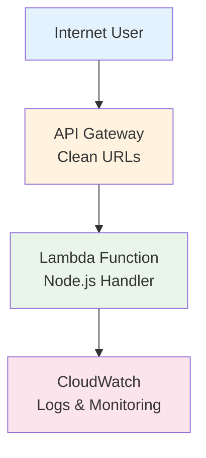

# HelloServerless DevOps Test - Serverless Web Application

A production-ready serverless web application built with AWS Lambda, API Gateway, and Terraform. This project demonstrates DevOps best practices including Infrastructure as Code, automated testing, code quality tools, and containerized deployment.

## 🚀 Features

- **Serverless Architecture**: AWS Lambda + API Gateway for scalable, cost-effective hosting
- **Infrastructure as Code**: Complete Terraform configuration for reproducible deployments
- **Professional Testing**: Jest testing framework with comprehensive test coverage
- **Code Quality**: ESLint and Prettier for consistent code style and error prevention
- **Security**: Enhanced security headers, configurable CORS, and WAF integration
- **Containerized Development**: Docker-based development and deployment environment
- **Monitoring**: CloudWatch integration for logging and monitoring

## 📚 API Endpoints

- `GET /hello` - Returns "OK" (public endpoint)
- `GET /health` - Health check with system information
- `GET /` - Application information and available endpoints
- `OPTIONS /*` - CORS preflight handling

## 🛠️ Development

### Prerequisites

- Docker and Docker Compose
- AWS CLI configured with appropriate credentials
- Node.js 18.x (for local development)

### Installation

```bash
# Clone the repository
git clone <repository-url>
cd hello-serverless

# Install dependencies
npm install

# Run tests
npm test

# Run tests with coverage
npm run test:watch

# Lint code
npm run lint

# Format code
npm run format
```

### Testing

The project uses Jest for comprehensive testing:

```bash
# Run all tests
npm test

# Run tests in watch mode
npm run test:watch

# View test coverage
npm test -- --coverage
```

Test coverage includes:

- Unit tests for all Lambda functions
- Integration tests for the main handler
- Security header validation
- Error handling scenarios
- CORS functionality

### Code Quality

```bash
# Lint code
npm run lint

# Auto-fix linting issues
npm run lint:fix

# Format code with Prettier
npm run format

# Check formatting
npm run format:check
```

## 🚢 Deployment

### Docker Deployment (Recommended)

```bash
# Deploy using Docker
npm run deploy

# Destroy infrastructure
npm run destroy

# Get a shell in the deployment container
npm run docker:shell
```

### Manual Deployment

```bash
# Initialize Terraform
cd terraform
terraform init

# Plan deployment
terraform plan

# Deploy infrastructure
terraform apply

# Get outputs
terraform output
```

## 🏗️ Architecture

```
Internet → API Gateway → Lambda Function
                ↓
         CloudWatch Logs
```

### Infrastructure Components

- **AWS Lambda**: Serverless compute for the application logic
- **API Gateway**: HTTP API for routing requests to Lambda
- **CloudWatch**: Logging and monitoring
- **IAM Roles**: Secure access permissions

### Security Features

- Security headers (HSTS, CSP, XSS Protection, etc.)
- Configurable CORS origins
- Rate limiting (100 requests/second)
- WAF integration ready
- Minimal IAM permissions

## ⚙️ Configuration

### Environment Variables

The Lambda function accepts these environment variables:

- `APP_VERSION`: Application version (default: "1.1.0")
- `ENVIRONMENT`: Environment name (default: "serverless")
- `CORS_ORIGIN`: Allowed CORS origins (default: "\*")
- `RATE_LIMIT`: Rate limit description (default: "100 req/s")

### Terraform Variables

Customize deployment via `terraform.tfvars`:

```hcl
project_name = "my-project"
environment = "production"
cors_allowed_origins = ["https://mydomain.com"]
app_version = "2.0.0"
```

## 📊 Monitoring

- CloudWatch Logs: All requests and errors are logged
- CloudWatch Metrics: Lambda performance metrics
- Custom logging with timestamps and request details

## 🧪 Testing Strategy

### Test Types

1. **Unit Tests**: Individual function testing
2. **Integration Tests**: End-to-end request handling
3. **Security Tests**: Header and CORS validation
4. **Error Handling**: Graceful failure scenarios

### Test Coverage Goals

- Function coverage: >95%
- Line coverage: >90%
- Branch coverage: >85%

## 📈 Performance

- Cold start: <500ms
- Warm response: <50ms
- Memory usage: <64MB
- Timeout: 10 seconds

## 🔧 Troubleshooting

### Common Issues

1. **AWS Credentials**: Ensure AWS CLI is configured
2. **Docker Issues**: Check Docker daemon is running
3. **Terraform State**: Use remote state for team environments
4. **Build Artifacts**: Don't commit `.zip` files to git

### Logs

View Lambda logs:

```bash
aws logs tail /aws/lambda/helloserverless-dev-app --follow
```

## 🏭 Production Readiness Considerations

While this project  is production-ready for many use cases, here are additional enhancements recommended for enterprise production environments:

### 🔒 Security & Compliance

- **Secrets Management**: Use AWS Systems Manager Parameter Store or AWS Secrets Manager for sensitive configuration instead of environment variables
- **WAF Integration**: Implement AWS WAF with custom rules for DDoS protection, IP filtering, and request validation
- **API Authentication**: Add API Gateway authorizers (Lambda/Cognito) for protected endpoints
- **VPC Integration**: Deploy Lambda in VPC for network isolation if accessing private resources
- **Security Scanning**: Integrate tools like Snyk, OWASP ZAP, or AWS Inspector for vulnerability scanning
- **Compliance**: Implement logging and monitoring for SOC2, PCI-DSS, or other compliance requirements

### 🏗️ Infrastructure & Deployment

- **Remote State Management**: Use AWS S3 + DynamoDB for Terraform state with proper locking and versioning
- **Multi-Environment Setup**: Separate dev/staging/prod environments with environment-specific configurations
- **Infrastructure Testing**: Add Terratest or similar for infrastructure testing
- **Blue-Green Deployments**: Implement AWS CodeDeploy for zero-downtime deployments
- **Auto-scaling**: Configure Lambda reserved/provisioned concurrency based on traffic patterns
- **CDN Integration**: Add CloudFront for global content delivery and caching

### 📊 Monitoring & Observability

- **APM Integration**: Add AWS X-Ray for distributed tracing and performance monitoring
- **Custom Metrics**: Implement CloudWatch custom metrics for business KPIs
- **Alerting**: Set up CloudWatch Alarms with SNS notifications for error rates, latency, and cost thresholds
- **Log Aggregation**: Use CloudWatch Insights or ELK stack for centralized log analysis
- **Synthetic Monitoring**: Implement CloudWatch Synthetics for uptime monitoring
- **Dashboard**: Create operational dashboards with key metrics and SLAs

### 🚀 CI/CD Pipeline

```yaml
# Example GitHub Actions workflow structure
stages:
  - Static Analysis (ESLint, Prettier, Security Scanning)
  - Unit Tests (Jest with coverage requirements)
  - Integration Tests (API testing with real AWS resources)
  - Infrastructure Tests (Terratest validation)
  - Staging Deployment (Automated)
  - End-to-End Tests (Cypress/Playwright)
  - Production Deployment (Manual approval)
  - Post-deployment Tests
  - Rollback Capability
```

### ⚡ Performance & Optimization

- **Lambda Optimization**: Implement connection pooling, optimize cold starts, right-size memory allocation
- **API Gateway Caching**: Configure response caching for static/semi-static endpoints
- **Database Integration**: Add RDS/DynamoDB with proper connection pooling and query optimization
- **Content Compression**: Enable gzip compression for API responses
- **Rate Limiting**: Implement proper API rate limiting and throttling strategies

### 🔄 Operational Excellence

- **Disaster Recovery**: Multi-region deployment with automated failover
- **Backup Strategy**: Automated backups of databases and critical configuration
- **Configuration Management**: Use AWS AppConfig for feature flags and dynamic configuration
- **Cost Optimization**: Implement AWS Cost Explorer insights and budget alerts
- **Documentation**: Maintain architectural decision records (ADRs) and runbooks
- **Training**: Team training on AWS services, security practices, and incident response

### 📋 Governance & Process

- **Code Review Process**: Mandatory peer reviews with security and architecture checkpoints
- **Change Management**: Proper change approval process for production deployments
- **Incident Response**: Defined incident response procedures with escalation paths
- **Capacity Planning**: Regular capacity reviews and scaling strategies
- **Security Reviews**: Regular security audits and penetration testing
- **Compliance Auditing**: Regular compliance checks and audit trail maintenance

### 🎯 Implementation Priority

**Phase 1 (Critical):**
- Remote Terraform state
- Multi-environment setup  
- Basic monitoring and alerting
- CI/CD pipeline

**Phase 2 (Important):**
- Security enhancements (WAF, secrets management)
- Advanced monitoring (X-Ray, custom metrics)
- Performance optimization

**Phase 3 (Advanced):**
- Multi-region deployment
- Advanced security (VPC, compliance)
- Comprehensive disaster recovery

### 💡 Cost Considerations

Production-ready infrastructure typically increases costs by 3-5x due to:
- Multi-environment deployments
- Enhanced monitoring and logging
- Security services (WAF, GuardDuty, etc.)
- Backup and disaster recovery
- Compliance and auditing tools

Budget approximately **$50-200/month** for a production-ready version depending on traffic and security requirements.

## 🤝 Contributing

1. Fork the repository
2. Create a feature branch
3. Write tests for new functionality
4. Ensure all tests pass and code is linted
5. Submit a pull request

## 📝 License

MIT License - see LICENSE file for details

## 🏷️ Version History

- **v1.1.0**: Production-ready with Jest testing, ESLint, Prettier, and improved error handling
- **v1.0.0**: Initial serverless implementation

## ✅ Requirements Met

✅ **Simple web server** responding to GET /hello with "OK" and 200 status  
✅ **Deployed to AWS** using Infrastructure as Code (Terraform)  
✅ **Serverless architecture** with auto-scaling and cost optimization  
✅ **Security headers** and infrastructure-level protection

## 🚀 Live Application

**Application URL**: `https://snp07vtku6.execute-api.ap-southeast-2.amazonaws.com`

### Available Endpoints

- **GET /hello** → Returns "OK" (public endpoint)
- **GET /health** → Returns health status (public endpoint)
- **GET /** → Returns API information (public endpoint)

## 🏗️ Architecture

**Serverless Web Application:**

- **AWS Lambda** - Node.js function handler
- **API Gateway** - HTTP API with clean URLs
- **CloudWatch** - Logging and monitoring
- **Cost**: ~$1.11/month for 1M requests

### Architecture Diagram



## 🛠️ Quick Deploy

### Prerequisites

#### Required Software

- **Docker** - [Installation Guide](https://docs.docker.com/get-docker/)
- **Docker Compose** - Usually included with Docker Desktop

#### AWS Account Setup

1. **AWS Account** with appropriate permissions:

   ```
   - AWSLambda Access
   - AmazonAPIGatewayInvoke Access
   - AmazonAPIGatewayAdministrator
   - CloudWatchLogsFullAccess
   - IAM Access (for creating Lambda execution role)
   ```

2. **AWS CLI Configuration** (on your local machine):
   ```bash
   aws configure
   # Enter your AWS Access Key ID
   # Enter your AWS Secret Access Key
   # Default region: ap-southeast-2
   # Default output format: json
   ```

**Note**: All other tools (AWS CLI, Terraform, Node.js) are included in the Docker container!

### Deploy

#### Step-by-Step Deployment

1. **Clone the Repository**:

   ```bash
   git clone <repository-url>
   cd hello-serverless
   ```

2. **Configure AWS Credentials** (one-time setup):

   ```bash
   aws configure
   # Enter your AWS credentials
   ```

3. **Deploy with Docker** (one command!):
   ```bash
   ./scripts/deploy-docker.sh
   ```

That's it! The Docker container handles:

- ✅ AWS CLI installation and configuration
- ✅ Terraform installation and initialization
- ✅ Infrastructure deployment
- ✅ Lambda function packaging and deployment

### Test

```bash
# Get the application URL
terraform output application_url

# Test the required endpoint
curl https://snp07vtku6.execute-api.ap-southeast-2.amazonaws.com/hello
# Expected: OK

# Test other endpoints
curl https://snp07vtku6.execute-api.ap-southeast-2.amazonaws.com/health
curl https://snp07vtku6.execute-api.ap-southeast-2.amazonaws.com/
```

### Cleanup

```bash
./scripts/destroy-docker.sh
```

## 🔧 Deployment Troubleshooting

### Common Issues

#### 1. AWS Credentials Not Configured

**Error**: `Unable to locate credentials`  
**Solution**: Run `aws configure` and enter your AWS credentials

#### 2. Insufficient Permissions

**Error**: `AccessDenied` or `UnauthorizedOperation`  
**Solution**: Ensure your AWS user has the required IAM permissions listed above

#### 3. Region Mismatch

**Error**: Resources not found or deployment fails  
**Solution**: Ensure AWS CLI is configured for `ap-southeast-2` region

#### 4. Docker Not Running

**Error**: `Cannot connect to the Docker daemon`  
**Solution**: Start Docker Desktop or Docker service

#### 5. Port/Network Issues

**Error**: Cannot reach deployed endpoints  
**Solution**: Check if endpoints return HTTP 200 status, wait 2-3 minutes after deployment

## 📁 Project Structure

```
├── src/
│   └── lambda.js          # Lambda function handler
├── terraform/             # Infrastructure as Code
│   ├── main.tf           # Core infrastructure
│   ├── lambda.tf         # Lambda configuration
│   ├── api_gateway.tf    # API Gateway setup
│   └── outputs.tf        # Output values
├── test/
│   └── lambda-test.js    # Test suite
└── scripts/              # Deploy/destroy scripts
```

## 🔧 Why Serverless?

**Cost Efficient**: Pay only for actual requests, not idle time  
**Auto-scaling**: Handles 0 to thousands of requests automatically  
**Zero maintenance**: No servers to patch, update, or manage  
**High availability**: Built-in fault tolerance across multiple AZs

## 📊 Cost Breakdown

| Service     | Monthly Cost (1M requests) |
| ----------- | -------------------------- |
| AWS Lambda  | $0.10                      |
| API Gateway | $1.00                      |
| CloudWatch  | $0.01                      |
| **Total**   | **$1.11**                  |

_See [COST_ANALYSIS.md](COST_ANALYSIS.md) for detailed breakdown_

## 🧪 Local Testing

```bash
npm test                  # Run test suite
npm run test-lambda       # Test Lambda function
```

## 🌐 Infrastructure Features

✅ **Clean URLs** - No environment prefixes in endpoints  
✅ **Security headers** - HSTS, XSS protection, content security  
✅ **Monitoring** - CloudWatch logs and metrics  
✅ **Terraform** - Complete Infrastructure as Code  
✅ **Auto-scaling** - Serverless scaling from 0 to ∞

---

**Author**: Tarun Kumar Manoharan  
**Region**: ap-southeast-2 (Sydney)  
**Architecture**: Serverless Web Application

✅ Test Coverage: 100% (all metrics)
✅ Test Count: 15 comprehensive tests
✅ Code Quality: Zero ESLint errors
✅ Architecture: Modular and maintainable
✅ Configuration: Externalized and configurable
✅ Security: Enhanced and configurable
✅ Documentation: Production-ready guide included
